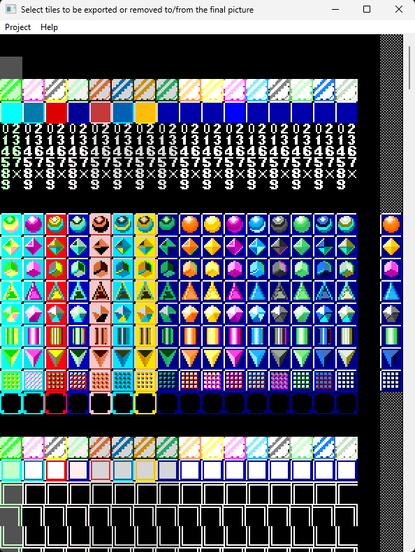

A set of Python scripts/tools to convert some Sharp's X68000 files to more usable states.

- x68k_adpcm_to_wav.py converts<br>
  ADPCM packed samples files to WAV files.

- x68k_adpcm_to_raw_8bits.py<br>
  converts ADPCM packed samples files to signed RAW 8 bits files.

- x68k_adpcm_to_raw_16bits.py<br>
  converts ADPCM packed samples files to signed RAW 16 bits files.

- x68k_4bits_chunky_to_png.py<br>
  converts 4 bits (16 colors) chunky graphics files to PNG files.

- x68k_8bits_chunky_to_png.py<br>
  converts 8 bits (256 colors) chunky graphics files to PNG files.

- x68k_16bits_true_colors_to_png.py<br>
  converts 65356 color pictures to PNG files.

- x68k_planar_to_png.py<br>
  converts 4 bits planar graphics files to PNG files.

- x68k_convert_color.py<br>
  converts a given 15 bits X68000 color to a color with a different bits range one.

- x68k_convert_palette.py<br>
  same as above but for complete palette files.

- x68k_16x16_tiles_extractor.py<br>
  converts 16x16 pixels tiled graphics files to PNG files.

- x68k_8x8_tiles_extractor.py<br>
  converts 8x8 pixels tiled graphics files to PNG files.

All scripts need "pypng" & "numpy":

```
pip install pypng
pip install numpy
```
The extractors (only tested on Windows) also need "wxpython":

```
pip install wxpython
```

These interactive tools are quite rudimentary, they basically look like this (on Windows):



With the tiles picture with all the palettes on the left and the user selected tiles on the right.

Tiles can be saved as PNG pictures (either all of them or just the selected ones) 
also indexes files can be created with the selected ones to be later reloaded in the tools.

